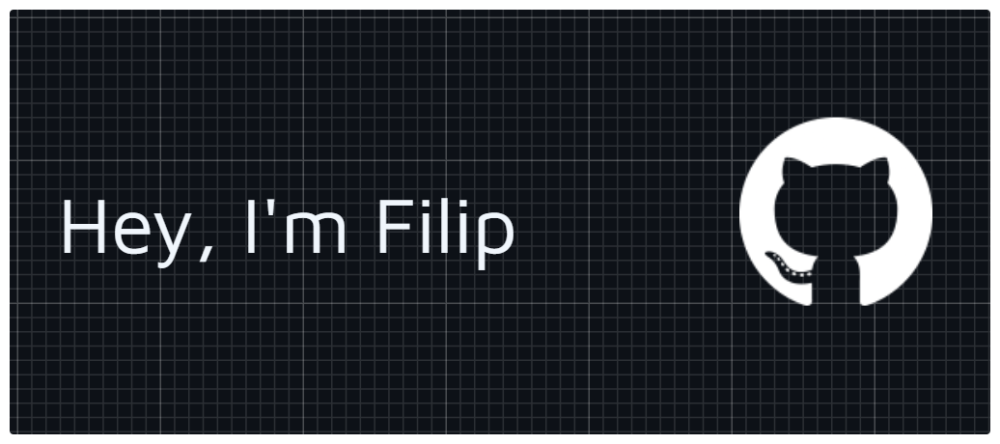

  
 <h3 align="center"> <strong>T Level Software Development Student | Full Stack Enthusiast</strong> </h3>  
 

---

 Currently Working On: **Developing an AI chatbot for my college**.

 Currently Learning: Advancing my skills in **JavaScript, Flask, SQL, & C++**.

 My Projects: Explore everything over at my **[Portfolio Website](https://dsdfilip.is-a.dev/)**.

 Let's Connect: You can drop me an email at **mxrecki.is.a.dev@gmail.com**

---

 
  
 <strong>Programming Languages & Backend</strong> 
 
     
 
 <strong>Frontend & Databases</strong> 
 
     
 
 <strong>Hardware, Design & Dev Tools</strong> 
 
     

